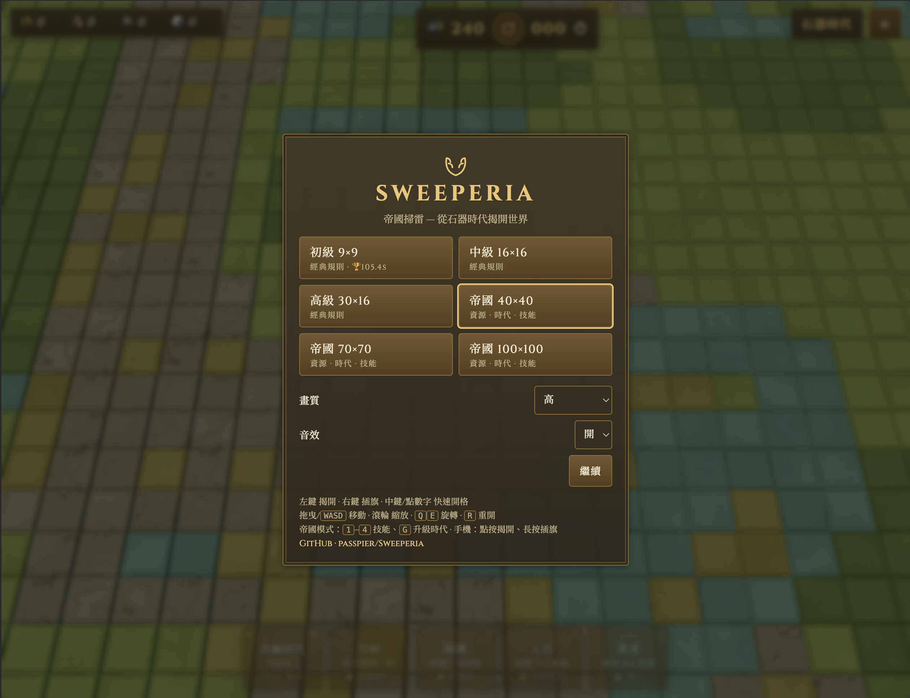

<h1 align="center">Sweeperia — 帝國掃雷</h1>

<p align="center">
  從石器時代揭開世界的 3D 掃雷遊戲。<br>
  經典規則之外，還有帶資源、時代、技能的「帝國模式」。
</p>

<p align="center">
  <a href="https://passpier.github.io/Sweeperia/"><b>▶ 線上試玩</b></a>
  &nbsp;·&nbsp;
  <a href="LICENSE"></a>
</p>

<p align="center">
  
</p>

## 特色

- 經典模式：初級 9×9、中級 16×16、高級 30×16
- 帝國模式：40×40 / 70×70 / 100×100，收集資源、升級時代、使用技能
- 3D 場景（水、樹、房屋），自動使用 WebGPU，不支援時退回 WebGL 2
- 畫質三段調整與自適應解析度；支援手機觸控
- 繁體中文 / English：依瀏覽器語言自動切換，也可在選單手動切換（`?lang=en`）
- 勝利後可分享

## 示範影片

<p align="center">
  <video src="https://github.com/user-attachments/assets/c18e4061-aa9e-41fe-871b-cc49f4089b90" controls width="560"></video>
</p>

## 操作

| 動作 | 桌機 | 手機 |
| --- | --- | --- |
| 揭開 | 左鍵 | 點按 |
| 插旗 | 右鍵 | 長按 |
| 快速開格 | 點數字 / 中鍵 | — |
| 移動 / 縮放 | 拖曳 或 WASD / 滾輪 | 拖曳 / 雙指 |
| 旋轉 | Q / E | — |
| 重開 | R | 點中間按鈕 |
| 帝國技能 / 升級時代 | 1–4 / G | 點按鈕 |

## 本機開發

```bash
npm install
npm run dev      # 開發伺服器
npm test         # 單元測試
npm run build    # 型別檢查 + 打包到 dist/
npm run preview  # 預覽打包結果
```

## 授權

本專案採用 [MIT License](LICENSE)。
